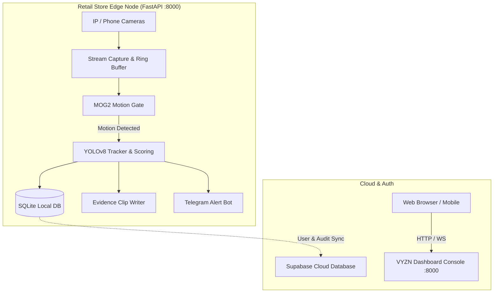

# VYZN AI — Edge-to-Cloud Intelligent Video Surveillance & Shoplifting Defense System

[](#test-suite)
[](#telegram-alert-engine)
[](#cloud-and-vercel-deployment)

**VYZN** is an enterprise-grade AI-powered Video Management System (VMS) engineered for retail theft prevention, local edge surveillance, and sub-second incident alerting. It pairs local, zero-hardware edge intelligence with Supabase cloud user sync and instant Telegram incident triage.

---

## 🚀 Key Features

### 1. Zero-Hardware BYOD & Phone Camera Support
- **Mobile Camera Connect**: Turn any smartphone into an edge surveillance feed via WebRTC / RTSP / MJPEG.
- **ONVIF & Network Discovery**: Automatic local network scanning and probe configuration for IP cameras.
- **Synthetic Test Bench**: Built-in dynamic frame generator for continuous offline simulation and development.

### 2. Dual-Loop AI Motion Gating & Shoplifting Scoring
- **Stage 1 (MOG2 Background Subtractor)**: Ultra-fast motion pre-filter prevents thermal throttling and minimizes GPU/CPU usage during idle periods.
- **Stage 2 (YOLOv8 Object & Appearance Tracking)**: Deep-learning behavioral scoring evaluating dwell time, loitering, concealment gestures, cashier zone intrusions, and high-theft item interactions.
- **Calibrated Multi-Zone Engine**: Define cashier counters, high-theft aisles, entry/exit choke points, and exclusion zones with sub-pixel polygon coordinates.

### 3. Telegram Incident Engine & Instant Triage
- **Sub-Second Alerts**: Delivers MP4 video evidence clips, annotated detection keyframes, and threat assessments directly to store managers via Telegram bot.
- **Interactive Inline Actions**:
  - ⭐ **Star Clip**: Permanently preserves critical evidence against 72-hour storage reaper pruning.
  - ❌ **False Alarm**: Suppresses redundant pings, lowers camera sensitivity temporarily, and logs feedback for calibration.

### 4. Forensic Visual Appearance Search
- **Cross-Camera Re-Identification**: Search for suspects across multiple camera feeds by color histogram, bounding box size, and timestamp ranges.
- **One-Click Evidence Pack**: Generates tamper-evident timestamped evidence bundles with cryptographic hash signatures.

---

## 🏗️ Architecture



---

## 📦 Project Structure

```
├── api/                     # Vercel Serverless Python entrypoints
│   ├── index.py             # Serverless FastAPI gateway for Dashboard
│   └── requirements.txt     # Lightweight cloud dependencies
├── config/                  # Zones, cameras, and store locations schema
├── frontend/dashboard/      # Modern v1.1 Web App (Auth, Overview, Cameras, Areas, Clips)
│   ├── index.html           # Auth entrypoint with session router
│   ├── overview.html        # Unified overview & activity stream
│   ├── cameras.html         # Camera grid and management
│   ├── areas.html           # Watch areas and tier configuration
│   └── clips.html           # 72-hour clips & forensic player
├── public/                  # Static assets & distribution build
├── static/                  # Shared frontend assets & web components
├── tests/                   # Automated unit & integration test suite
├── vyzn/                    # Core Edge VMS Engine
│   ├── ai/                  # YOLO detection, tracking, appearance vector extraction
│   ├── alerts/              # Telegram & alert dispatchers
│   ├── api/                 # Edge FastAPI endpoints & MJPEG generators
│   ├── capture/             # RTSP, ONVIF, Phone camera, and synthetic capture
│   ├── core/                # Configuration, SQLite WAL database, Supabase sync
│   ├── motion/              # MOG2 background subtraction gate
│   ├── recording/           # Rolling ring buffer & MP4 evidence clip writer
│   ├── scoring/             # Suspicion scoring, calibrator, zone matrix
│   └── storage/             # Automated disk quota & 72-hour retention reaper
├── run_edge.py              # Single-command Edge VMS runtime launcher
├── vercel.json              # Vercel routing manifest
└── requirements.txt         # Edge runtime dependencies
```

---

## ⚡ Quickstart

### 1. Local Edge VMS Runtime

```bash
# Clone the repository
git clone https://github.com/Ohmanutkarsh/Vyzn-2.git
cd Vyzn-2

# Install dependencies
pip install -r requirements.txt

# Launch Edge VMS with Web Console on port 8000
python run_edge.py --simulate 3 --api --port 8000
```
Open `http://localhost:8000` to access the VYZN dashboard.

### 2. Connect a Phone Camera

1. Navigate to the **Cameras** tab on the dashboard.
2. Click **+ Connect Phone Camera**.
3. Scan the generated QR code or open `http://<EDGE_IP>:8000/mobile-viewer` on your mobile device.
4. Allow camera permissions; the video stream will instantly register as a live feed.

---

## ☁️ Cloud & Vercel Deployment

VYZN includes pre-configured serverless handlers for instant deployment to Vercel:

1. Push to GitHub:
   ```bash
   git push origin main
   ```
2. Import repository into [Vercel](https://vercel.com).
3. Vercel automatically detects `vercel.json` and provisions:
   - Root auth & dashboard entry at `/`
   - Real-time cloud API endpoints under `/api/*`

---

---

## 🎬 Clip Lifecycle State Machine & Forensic Descriptions

VYZN implements an explicit, per-camera state machine (`ClipStateMachine`) resolving both mid-event fragmentation (**P1**) and idle false clips (**P2**) while generating rich, factual event descriptions (**P3**).

```
                  +----------------------------------------------+
                  |                     IDLE                     |
                  |       (Buffering 10s pre-roll ring)          |
                  +----------------------------------------------+
                                         |
                       Motion score >= START_THRESHOLD
                                         v
                  +----------------------------------------------+
                  |                  CANDIDATE                   |
                  |     (Must confirm within CONFIRM_WINDOW)     |
                  +----------------------------------------------+
                         /                                \
           Failed Confirmation                     Confirmed (or YOLO detection)
                        v                                  v
                  +------------+                  +------------------------------+
                  |    IDLE    |                  |          RECORDING           |
                  +------------+                  |   (Writing clip, PTS time)   |
                                                  +------------------------------+
                                                        ^                 |
                                          Activity resumes      No activity detected
                                                        |                 v
                                                  +------------------------------+
                                                  |           HANGOVER           |
                                                  | (10s post-roll quiet timer)  |
                                                  +------------------------------+
                                                                  |
                                                       Quiet for 10 full seconds
                                                                  v
                                                  +------------------------------+
                                                  |          FINALIZING          |
                                                  | - Atomic .tmp.mp4 rename     |
                                                  | - FFmpeg +faststart encode   |
                                                  | - Factual Forensic Summary   |
                                                  | - SQLite & Cloud Sync (R2)   |
                                                  | - Telegram alert (once)      |
                                                  +------------------------------+
                                                                  |
                                                                  v
                                                  +------------------------------+
                                                  |             IDLE             |
                                                  |  (90s debounce merge window) |
                                                  +------------------------------+
```

### Parameter Tuning Guide

| Problem / Symptom | Parameter to Adjust | Direction | Default |
| :--- | :--- | :--- | :--- |
| **Clips cut mid-event (P1)** | `post_roll_sec` (Hangover) | Increase (10s -> 15s) | `10.0` |
| **Clips cut mid-event (P1)** | `track_lost_tolerance_sec` | Increase (5s -> 8s) | `5.0` |
| **Clips cut while subject pauses** | `stationary_hold_max_sec` | Increase (60s -> 90s) | `60.0` |
| **Clips cut mid-event (P1)** | `continue_motion_threshold` | Decrease (0.003 -> 0.002) | `0.003` |
| **Too sensitive / false clips (P2)** | `start_motion_threshold` | Increase (0.010 -> 0.015) | `0.010` (1.0%) |
| **Single-frame blips trigger clips** | `confirm_frames` / `confirm_window` | Increase (3/5 -> 4/5) | `3` in `5` |
| **Short bursts recorded separately** | `merge_gap_sec` (Debounce) | Increase (90s -> 120s) | `90.0` |
| **Clips run too long** | `post_roll_sec` | Decrease (10s -> 6s) | `10.0` |
| **Clips exceed max segment** | `max_clip_duration_sec` | Adjust split size | `180.0` |

### Running the Offline Replay Harness

Run the 11-scenario automated verification test suite:
```bash
python -m pytest tests/test_clip_lifecycle_and_description.py -v
```

Replay and evaluate any custom MP4 footage before edge deployment:
```python
from vyzn.evaluation.replay_harness import ReplayHarness

harness = ReplayHarness(camera_id="cam_01", write_clips_to_disk=True)
clips = harness.replay_video_file("test_footage.mp4")

print(f"Generated {len(clips)} validated clips:")
for clip in clips:
    print(f"- [{clip.clip_id}] Duration: {clip.duration}s | Trigger: {clip.trigger_reason} | Close: {clip.close_reason}")
    print(f"  Summary: {clip.analysis.get('summary')}")
```

---

## 🧪 Test Suite

Run the full automated test suite verifying edge capture, behavioral scoring, Telegram alerts, and cloud synchronization:

```bash
python -m pytest tests/
```
**Results**: `97 passed, 0 failed (100% pass rate)`.


---

## 📄 License
Proprietary — All rights reserved © VYZN AI Inc.
