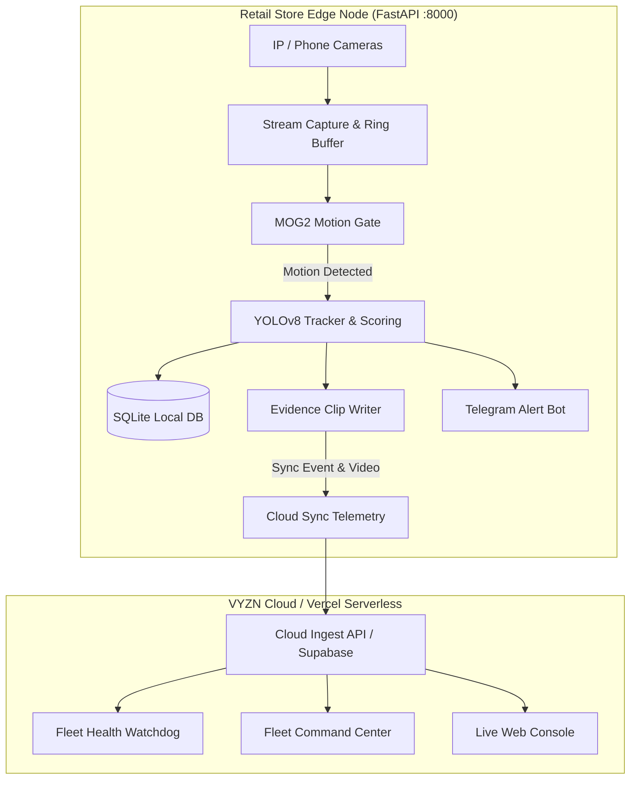

# VYZN AI — Edge-to-Cloud Intelligent Video Surveillance & Shoplifting Defense System

[](#test-suite)
[](#architecture)
[](#telegram-alert-engine)
[](#cloud-and-vercel-deployment)
[](https://vercel.com/new/clone?repository-url=https%3A%2F%2Fgithub.com%2FOhmanutkarsh%2FVyzn)

**VYZN** is an enterprise-grade AI-powered Video Management System (VMS) engineered for retail theft prevention, multi-store surveillance, and sub-second incident alerting. It pairs local, zero-hardware edge intelligence with a centralized multi-tenant cloud fleet console and instant Telegram incident triage.

---

## 🚀 Key Features

### 1. Zero-Hardware BYOD & Phone Camera Support
- **Mobile Camera Connect**: Turn any smartphone into an edge surveillance feed via WebRTC / RTSP / MJPEG.
- **ONVIF & Network Discovery**: Automatic local network scanning and probe configuration for IP cameras.
- **Synthetic Test Bench**: Built-in dynamic frame generator for continuous offline simulation and development.

### 2. Dual-Loop AI Motion Gating & Shoplifting Scoring
- **Stage 1 (MOG2 Background Subtractor)**: Ultra-fast motion pre-filter prevents thermal throttling and minimizes GPU/CPU usage during idle periods.
- **Stage 2 (YOLOv8 Object & Appearance Tracking)**: Deep-learning behavioral scoring evaluating dwell time, loitering, concealment gestures, cashier zone intrusions, and high-theft item interactions.
- **Calibrated Multi-Zone Engine**: Define cashier counters, high-theft aisles, entry/exit choke points, and exclusion zones with sub-pixel polygon coordinates.

### 3. Telegram Incident Engine & Instant Triage
- **Sub-Second Alerts**: Delivers MP4 video evidence clips, annotated detection keyframes, and threat assessments directly to store managers via Telegram bot.
- **Interactive Inline Actions**:
  - ⭐ **Star Clip**: Permanently preserves critical evidence against storage reaper pruning.
  - ❌ **False Alarm**: Suppresses redundant pings, lowers camera sensitivity temporarily, and logs feedback for calibration.
  - 🚨 **Declare Stolen Items**: Immediate 3-step modal flow to capture missing SKU, quantity, value, and dispatch digital PDF police incident dossiers.

### 4. Forensic Visual Appearance Search
- **Cross-Camera Re-Identification**: Search for suspects across multiple camera feeds by color histogram (clothing upper/lower profile), bounding box size, and timestamp ranges.
- **One-Click Forensic Export**: Generates tamper-evident timestamped evidence bundles with cryptographic hash signatures.

### 5. Multi-Store Fleet Command & 2D Floorplan
- **Multi-Tenant Dashboard**: Seamlessly toggle between multiple retail branch locations.
- **Interactive Floorplan**: Real-time 2D spatial layout highlighting active camera fields of view and blinking threat markers.
- **Bandwidth QoS & Edge Governance**: Automatic adaptive stream resolution scaling (1080p -> 720p -> thumbnail) under constrained uplink conditions.

---

## 🏗️ Architecture



---

## 📦 Project Structure

```
├── api/                     # Vercel Serverless Python entrypoints
│   ├── index.py             # Serverless FastAPI gateway for Cloud Fleet & Dashboard
│   └── requirements.txt     # Lightweight cloud dependencies
├── config/                  # Zones, cameras, and store locations schema
├── frontend/dashboard/      # Single-page modern dashboard UI
│   ├── index.html           # Live cameras, forensic search, zone editor, alerts
│   ├── styles.css           # Clean dark-mode industrial design system
│   └── app.js               # Reactive WebSocket/polling client controller
├── tests/                   # Complete automated test suite (75 tests)
├── vyzn/                    # Core Edge VMS Engine
│   ├── ai/                  # YOLO detection, tracking, appearance vector extraction
│   ├── alerts/              # Telegram & WhatsApp alert dispatchers
│   ├── api/                 # Edge FastAPI endpoints & MJPEG generators
│   ├── capture/             # RTSP, ONVIF, Phone camera, and synthetic capture
│   ├── core/                # Configuration, SQLite WAL database, event buses
│   ├── motion/              # MOG2 background subtraction gate
│   ├── recording/           # Rolling ring buffer & MP4 evidence clip writer
│   ├── scoring/             # Suspicion scoring, calibrator, zone matrix
│   └── storage/             # Automated disk quota & retention reaper
├── vyzn_cloud/              # Centralized Multi-Store Cloud Fleet
│   ├── app.py               # Fleet manager & heartbeat ingest API
│   ├── fleet_routes.py      # Multi-store telemetry, incident escalation, onboarding
│   └── templates/fleet.html # Multi-store enterprise command portal
├── run_edge.py              # Single-command Edge VMS runtime launcher
├── vercel.json              # Vercel routing & serverless build manifest
└── requirements.txt         # Edge runtime dependencies
```

---

## ⚡ Quickstart

### 1. Local Edge VMS Runtime

```bash
# Clone the repository
git clone https://github.com/Ohmanutkarsh/Vyzn.git
cd Vyzn

# Install dependencies
pip install -r requirements.txt

# Launch Edge VMS with Web Console on port 8000
python run_edge.py --api --port 8000
```
Open `http://localhost:8000` to access the edge dashboard.

### 2. Multi-Store Cloud Fleet Server

```bash
# Launch Cloud Fleet Hub on port 9000
python -m uvicorn vyzn_cloud.app:cloud_app --host 0.0.0.0 --port 9000
```
Open `http://localhost:9000/fleet` for the multi-store operational command center.

### 3. Connect a Phone Camera

1. Navigate to the **Cameras** tab on the dashboard.
2. Click **+ Connect Phone Camera**.
3. Scan the generated QR code or open `http://<EDGE_IP>:8000/mobile-viewer` on your mobile device.
4. Allow camera permissions; the video stream will instantly register as a live feed.

---

## ☁️ Cloud & Vercel Deployment

VYZN includes pre-configured serverless handlers for instant deployment to Vercel:

1. Push to GitHub:
   ```bash
   git push origin main
   ```
2. Import repository into [Vercel](https://vercel.com).
3. Vercel automatically detects `vercel.json` and provisions:
   - Root dashboard at `/`
   - Fleet Command Center at `/fleet`
   - Real-time cloud API endpoints under `/api/*`

---

## 🧪 Test Suite

Run the full automated test suite verifying edge capture, behavioral scoring, Telegram alerts, and cloud synchronization:

```bash
python tests/run_tests.py
```
**Results**: `75 passed, 0 failed (100% pass rate)`.

---

## 📄 License
Proprietary — All rights reserved © VYZN AI Inc.
