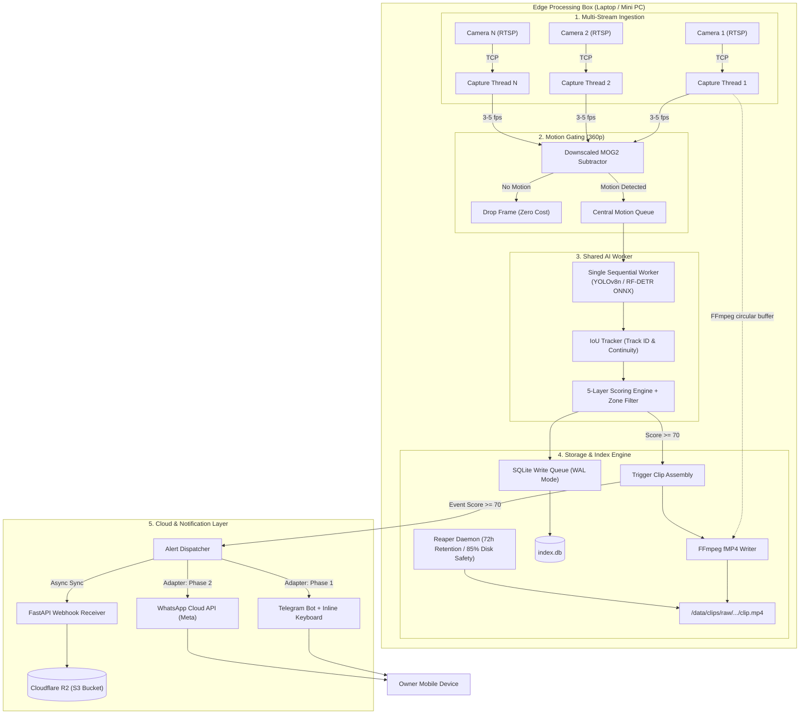

# VYZN (Netra) — Master Architectural Roadmap

> **System Thesis:** Small Indian businesses do not need more camera footage; they need zero-fatigue high-confidence alerting. The system that gets muted is dead.

---

## 1. Executive Summary & Document Reconciliation

This Master Roadmap unifies and resolves the tension between two distinct project plans:
1. **The College Project Plan (v7):** Two-person team, 2–5 RTSP streams, rapid 3-week build, Telegram alerting, academic demo focus.
2. **The Commercial Product Plan & PRD:** Indian SMB focus (shops/warehouses), WhatsApp-native, ₹1,000–2,500/camera/month anchor pricing, strict India DPDP Act 2023 compliance.

### The Unified Strategy: "Zero-Throwaway Evolution"
We do not build a toy for college and then throw it away for the commercial pilot. We engineer the core edge engine to commercial stability standards from Day 1, while isolating the alert and transport layers behind clean interfaces:
- **Phase 0–1 (Core Engine & College Demo):** Runs locally on existing laptops/hardware, supports 2–5 streams via simulated RTSP (`mediamtx`), scores with calibrated 5-layer logic, and delivers alerts via **Telegram Bot** (zero setup cost, instant inline triage buttons for grading demo).
- **Phase 2 (Commercial Pilot):** Swaps the notification adapter to **WhatsApp Cloud API** (Meta Cloud Platform), introduces per-camera schedules/zones, and deploys to 3–5 live retail shops in Maharashtra.
- **Phase 3 (Paid Beta & Hardening):** Full multi-tenant cloud sync (FastAPI + Cloudflare R2), DPDP Act retention & audit log engine, and migration from YOLO (AGPL-3.0) to RF-DETR (Apache 2.0).

---

## 2. Engineering Critiques & Architectural Decisions

Every design choice from prior revisions was audited. Below are the critical failure points identified and their definitive fixes:

| Subsystem | Prior Plan Flaw / Trap | Principal Engineer Critique | Production Architectural Fix |
| :--- | :--- | :--- | :--- |
| **Video Capture & Pre-Roll** | `cv2.VideoCapture` pushing raw frames into a Python `deque(maxlen=fps*10)`. | **Fatal Memory Leak:** 10s of raw 1080p BGR frames at 25 fps = 250 frames ≈ 1.55 GB RAM *per camera*. 5 streams = **7.75 GB RAM**, crashing edge devices instantly. | **Dual-Stream Pipeline:**<br>1. *Inference Stream:* OpenCV decodes downscaled frames (640×360 @ 4 fps = ~28 MB total).<br>2. *Recording Stream:* Direct FFmpeg subprocess captures RTSP to native circular H.264 segmented chunks (`fMP4`), bypassing Python RAM entirely. |
| **Stream Reliability** | Unconfigured `cv2.VideoCapture` on RTSP. | OpenCV defaults to RTSP over UDP. Packet loss causes corrupted gray macroblocks, and socket timeouts block Python threads indefinitely. | Force TCP transport (`rtsp_transport;tcp`) and hardware socket timeout (`stimeout;5000000`). Watchdog terminates and recreates stream after 8s frame silence. |
| **Tracking Engine** | Naive centroid matching. | Occlusion failure: when an Indian shopkeeper walks behind a counter or customers cross, centroid tracking drops identity and triggers duplicate alerts. | **IoU Tracker with 30-frame coasting:** Lightweight NumPy tracker maintaining track continuity across brief occlusions with zero GPU overhead. |
| **Object Detection Licensing** | Ultralytics YOLOv8/v11 (AGPL-3.0). | **AGPL Poison Pill:** Connecting AGPL code to a hosted multi-tenant API or webhook triggers viral copyleft, forcing full open-source disclosure of proprietary SaaS. | **Model Abstraction Layer (`DetectorInterface`):** Wrap YOLOv8n behind an abstract class. Validate pipeline with YOLO locally; swap to **RF-DETR Nano (Apache 2.0)** or ONNX Runtime before commercial pilot. |
| **Alert Delivery** | Direct Telegram Bot vs WhatsApp Cloud API. | Telegram is free and fast for college grading, but Indian shopkeepers do not use Telegram. WhatsApp Cloud API is essential for commercial adoption but requires Meta approval. | **Adapter Pattern (`AlertProvider`):** Abstract alert interface with interchangeable `TelegramProvider` (for Phase 1 demo) and `WhatsAppCloudProvider` (for Phase 2 pilot). |
| **Power Loss Resilience** | Standard MP4 container recording. | Frequent power cuts in Tier-2/3 Indian cities corrupt standard MP4 files because the `moov` atom is only written at clean exit. | Encode using **Fragmented MP4 (`fMP4`)** with `-movflags +frag_keyframe+empty_moov+default_base_moof`. Every recorded second remains playable post-crash. |
| **Database Concurrency** | SQLite WAL mode accessed across multiple processes. | Windows filesystem locking can throw `sqlite3.OperationalError: database is locked` under multi-process write contention. | Configure `PRAGMA busy_timeout = 5000;`, `PRAGMA journal_mode = WAL;`, `PRAGMA synchronous = NORMAL;`, and route all writes through a single async SQLite queue worker. |
| **Alert Fatigue Failure** | Alerting on "Person Detected" 24/7. | During business hours, hundreds of customer entries trigger continuous alerts. System is muted within 24 hours. | **Layer 0 Business Hours & Zone Filter:** Alerts during shop open hours trigger *only* for restricted zones (cash counter, backroom safe). Outer cameras alert only after-hours. |

---

## 3. High-Level System Architecture



---

## 4. The 5-Layer Scoring Formula (Calibrated)

An alert is dispatched **only if** the final score satisfies:
$$\text{Final Score} \ge 70 \quad \text{AND} \quad \text{Schedule/Zone Gate} == \text{True}$$

### Layer Specifications:
1. **Layer 1: Motion Extent ($0\text{--}20\text{ pts}$)**
   $$\text{Score}_{L1} = \min\left(20, \frac{\text{Motion Pixel Area}}{\text{Frame Area}} \times 100 \times 2\right)$$
2. **Layer 2: Classification Confidence ($0\text{--}30\text{ pts}$)**
   $$\text{Score}_{L2} = \text{Detector Confidence} \times 30$$
3. **Layer 3: Object-Type Base Weight ($0\text{--}40\text{ pts}$)**
   - Person: $40\text{ pts}$
   - Vehicle: $35\text{ pts}$
   - Animal: $15\text{ pts}$
   - Unclassified Motion: $0\text{ pts}$
4. **Layer 4: Nuisance Penalty vs. Valid Floor**
   - If Object is **Unclassified Motion**: Apply penalty of $-35\text{ pts}$.
   - If Object is **Valid Detection** (Person / Vehicle with Conf $\ge 0.40$): Hard floor at $50\text{ pts}$ ($\text{Subtotal} = \max(50, \text{Subtotal})$).
5. **Layer 5: Persistence Bonus ($0\text{--}15\text{ pts}$)**
   - Tracked across continuous frames: $+3\text{ pts per second of continuous track}$ (up to $+15\text{ pts}$). Filters single-frame noise/headlight glints.

### Layer 0: Schedule & Zone Hard Gate (Fatigue Elimination)
- **Active Business Hours (e.g. 09:00–21:00):**
  - General customer areas: **Suppress Alerts** (Log to SQLite only, no push).
  - Restricted Zones (Cash Counter, Backroom, Safe): **Evaluate Score**.
- **After-Hours (e.g. 21:01–08:59):**
  - All cameras active. Any detection $\ge 70$ fires instant notification.

---

## 5. Phased Roadmap & Milestone Gates

```
+---------------------------------------------------------------------------------------+
|  Phase 0: Benchmark & Validation  (Week 1)                                            |
|  - Synthetic 5-camera RTSP testbed (mediamtx + ffmpeg loop)                           |
|  - Ground-truth clip benchmark (Day vs Night IR)                                      |
|  - 10-15 Local shopkeeper interviews (Nagpur/MH pain validation)                     |
+-------------------------------------------+-------------------------------------------+
                                            |
                                            v
+---------------------------------------------------------------------------------------+
|  Phase 1: Dual-Track Technical MVP  (Weeks 2-3)  [College Project Demo Milestone]    |
|  * Edge Track (Person A):                                                             |
|    - 2-5 RTSP thread capture with TCP/reconnect watchdog                              |
|    - Downscaled MOG2 + Centralized YOLOv8n worker queue                               |
|    - IoU tracker + 5-layer scoring engine                                             |
|    - SQLite WAL event database + FFmpeg fMP4 segmented clip writer                    |
|    - 72h / 85% disk reaper daemon                                                     |
|  * Cloud/Alert Track (Person B):                                                      |
|    - FastAPI webhook receiver (async clip ingest + auth header)                       |
|    - Telegram alert bot with inline triage ("Important" / "False Alarm")              |
|    - Streamlit local review dashboard                                                 |
|  * Gate: 1 full week autonomous run on 2-5 streams without crash, memory leak, or OOM |
+-------------------------------------------+-------------------------------------------+
                                            |
                                            v
+---------------------------------------------------------------------------------------+
|  Phase 2: Real-World Commercial Pilot  (Weeks 4-6)                                    |
|  - Meta WhatsApp Cloud API integration (replacing Telegram for owners)               |
|  - Schedule & Zone configuration engine (business hours vs night)                     |
|  - Deploy 3-5 real physical shop pilots (grocery/hardware stores in Maharashtra)      |
|  - Cloudflare R2 backup for high-confidence clips (>=70)                              |
|  - Gate: >=2 owners declare they would be upset if system is removed; <2 false alerts/wk|
+-------------------------------------------+-------------------------------------------+
                                            |
                                            v
+---------------------------------------------------------------------------------------+
|  Phase 3: Commercial Hardening & Compliance  (Weeks 7-9)                              |
|  - Model licensing switch: Migrate YOLOv8 to RF-DETR Nano (Apache 2.0)               |
|  - DPDP Act 2023 compliance engine (45-day auto-purge, verifiable audit trail)       |
|  - Bilingual signage generation tool (Marathi/Hindi/English QR notice)                |
|  - Multi-tenant cloud backend (Postgres/Supabase) + Owner Web Portal (Next.js)        |
+---------------------------------------------------------------------------------------+
```

---

## 6. Two-Person Parallel Execution Track (College Phase)

To eliminate blocked workflows between Person A and Person B, the **SQLite Event Schema** and **Webhook Payload** serve as the immutable contract:

### The SQLite Contract (`/data/clips/index.db`)
```sql
CREATE TABLE IF NOT EXISTS events (
    event_group_id TEXT PRIMARY KEY,
    camera_id TEXT NOT NULL,
    start_time TEXT NOT NULL,          -- ISO 8601 UTC
    end_time TEXT,                     -- ISO 8601 UTC
    object_type TEXT NOT NULL,         -- 'person' | 'vehicle' | 'animal' | 'motion'
    confidence REAL NOT NULL,          -- 0.00 to 1.00
    score INTEGER NOT NULL,            -- 0 to 100
    status TEXT DEFAULT 'raw',         -- 'raw' | 'compressed' | 'deleted'
    starred INTEGER DEFAULT 0,         -- 0 or 1
    synced INTEGER DEFAULT 0,          -- 0 or 1 (updated by Cloud Sync)
    file_path TEXT NOT NULL,           -- Local absolute path to fMP4
    thumb_path TEXT NOT NULL           -- Local path to JPEG thumbnail
);

CREATE INDEX IF NOT EXISTS idx_events_camera_time ON events(camera_id, start_time);
CREATE INDEX IF NOT EXISTS idx_events_synced ON events(synced, score);
```

### Responsibility Matrix:
- **Person A (Edge Systems):**
  - Camera capture threads, reconnect watchdog, frame decimation.
  - MOG2 pre-filter, shared model queue, detection & IoU tracking.
  - FFmpeg fragmented MP4 pre-roll recording.
  - SQLite writer queue and disk reaper daemon.
- **Person B (Cloud, Alerts & Review):**
  - FastAPI webhook endpoint (`POST /api/v1/events`).
  - Telegram alert bot with video attachment and inline callback buttons.
  - WhatsApp Cloud API adapter.
  - Cloudflare R2 object storage synchronizer.
  - Streamlit review UI for local video playback and scoring inspection.

---

## 7. Immediate Action Items

1. **Verify Development Environment:** Initialize Python 3.11+ virtualenv, install OpenCV (`opencv-python-headless`), PyAV / FFmpeg, and ONNX Runtime / Ultralytics.
2. **Build RTSP Simulation Rig:** Deploy `mediamtx` with a looped 1080p sample video via FFmpeg to simulate 3 concurrent RTSP streams on localhost.
3. **Execute Phase 0 Sanity Check:** Verify motion gating threshold and detection latency on Day and Night sample clips.
